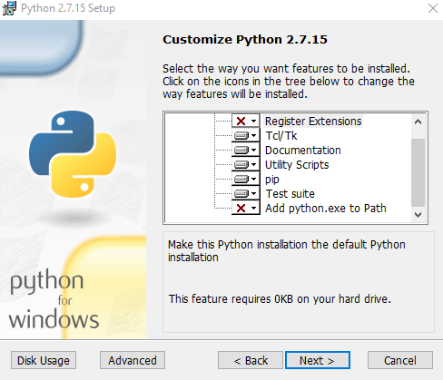
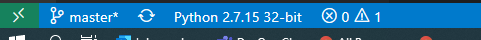

## Setting Up Your Development Environment

You can use mac, linux, windows.  If you are having trouble setting up your development environment let us know right away and we can help or possibly give you alternative instructions that may work better.  

## Spin Up Azure Blockchain Service

You will need an Azure Subscription with at least OWNER on one resource group
  * A [free trial Azure subscription](https://azure.microsoft.com/free/?ref=microsoft.com&utm_source=microsoft.com&utm_medium=docs&utm_campaign=visualstudio) _might_ work but cannot be guaranteed (service requirements change). 
  * consider using your MSDN subscription if you have one.  

1. Login to the Azure portal and search for `Azure Blockchain Service` and follow the prompts to create it.  **Do not choose "Azure Workbench", make sure you choose Azure Blockchain Service**

>> What is the difference?  Workbench is a set of micro-services that allow a developer to create a complete blockchain solution.  It's great to get started quickly but doesn't offer a lot of customization for the individual Azure Services.  `Azure Blockchain Service` is just the managed ledger service with consortium management.  Frankly, you could spin up either for this workshop but Workbench will take quite a while to spin up and we don't need all of the capabilities for this workshop.  

* Please note your resource group name and region/location.  This will be needed later.  I suggest spinning everything up in `eastus`.
* Protocol: `Quorum`
* Consortium:  must be unique across all tenants.  This is what we will use when we want to invite other organizations into our blockchain solution.  
* Pricing:  use the default or lower it to 1 vCore if needed.
* **Don't forget your passwords.  Note all settings somewhere for the future**
* **This will take at least 15-30 minutes to spin up**

>> Continue to the next steps while Azure Blockchain service is spinning up.

## Local Software Requirements

*More information can be found [here](https://docs.microsoft.com/en-us/azure/blockchain/service/connect-vscode) regarding the software needed to build Smart Contracts.* 

 ### Container-based development environment

**If you are comfortable with Docker containers the entire devenv is available as one Docker container you can run on your machine.  Please see [the devenv container instructions here](./docker-dev-env/README.md).*

You will still need to follow the software verification steps below.  

### Local Installation of all tools **with verification steps**

If you have issues with the installations, let us know.  Python is particularly finnicky. 

* vscode
  * consider setting the default shell in vscode to `git bash` or `wsl`.  CTL+Shft+P then `terminal: seelect default shell`
* an ssh client should be available.  Putty is a good choice, or WSL, or `git bash`
* [Node.js 10.15.x or higher](https://nodejs.org/en/) 
  * to check for node: `node --version`
  * this is needed for npm later
* git (2.10 +)
  * `git --version`
* [python 2.7.15](https://www.python.org/downloads/release/python-2715/)
  * **Please note:  you MUST have python 2.7.15.  I know this is old but it is REQUIRED for some of the OSS tooling.  Python3 won't work.  Not my fault**.  This requirement may change any day.  

>> Verification Steps: Ensure py27 is working with vscode: 
>> * Open vscode 
>> * Ctl + Shift + P
>> * begin typing `Python: select interpreter`
>> * Ensure 2.7.15 is available.  If it isn't, you need to install it.  

* Install python on windows
    * download 32bit from the link above
    * note the install location.  You'll need it:
    *  
    * Choose these options.  Note that `Register Extensions` and `Add python to path` are DISABLED .  
    * We do this because python 2.7 is very old and unsupported.  We don't want to ruin your existing python environment.  
    * Now follow the Verification Steps above.  
* [Truffle 5.0.0](https://www.trufflesuite.com/docs/truffle/getting-started/installation)
  * to verify:  `npm install -g truffle`
* [Ganache](https://github.com/trufflesuite/ganache-cli)
  * full Ganache is not required but is useful for local blockchain development.  
  * minimally, ganache-cli is needed for vscode to communicate with Azure Blockchain service.
  * `npm install -g ganache-cli`
  * to verify `ganache-cli version`  then ctl+C to exit.  
* Azure Blockchain DevKit for Ethereum
  * install it with the following command on any OS: `code --install-extension azblockchain.azure-blockchain`
  * now we need to confirm it's working
  * restart vscode
  * Ctl+Shift-P to open the command palette
  * `Python: Select Interpreter`
  * choose `Python 2.7.15`
  * Your lower left statusbar should look like this:
  
  * Ctl+Shift-P to open the command palette again
  * `Blockchain: Show Welcome Page`
  * It may take a few seconds to display, it is checking your software dependencies.  
  * **At this point you may see errors about required software missing.  We need to resolve those issues NOW**

### Most Common Problem:  Resolving python 2.7 Issues

If you have an error screen like this:

...it probably means vscode and the AzBC extension aren't recognizing python is installed.  Look at the vscode statusbar near the left.  Make sure it says `Python 2.7.15` .  

As long as it does, you can continue.  

  
## Connect vscode to Azure Blockchain Service

**Perform these steps from your local environment or from the devenv container.**

* In the vscode explorer pane, expand the `Blockchain Networks` option

* Choose `Connect to Network`, and `Azure Blockchain` and connect to your consortium

**You did it, everything is working!**

We can now move on and show how to create Smart Contracts on a blockchain.  
