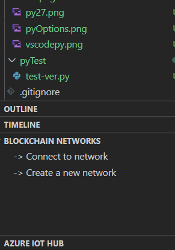
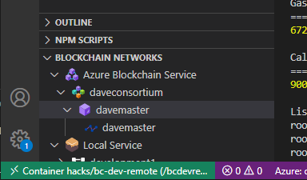

## Setting Up Your Development Environment

You can use mac, linux, windows.  If you are having trouble setting up your development environment let us know right away and we can help or possibly give you alternative instructions that may work better.  

## Spin Up Azure Blockchain Service

You will need an Azure Subscription with at least OWNER on one resource group
  * A [free trial Azure subscription](https://azure.microsoft.com/free/?ref=microsoft.com&utm_source=microsoft.com&utm_medium=docs&utm_campaign=visualstudio) _might_ work but cannot be guaranteed (service requirements change). 
  * consider using your MSDN subscription if you have one.  

1. Login to the Azure portal and search for `Azure Blockchain Service` and follow the prompts to create it.  **Do not choose "Azure Workbench", make sure you choose Azure Blockchain Service**

>> What is the difference?  Workbench is a set of micro-services that allow a developer to create a complete blockchain solution.  It's great to get started quickly but doesn't offer a lot of customization for the individual Azure Services.  `Azure Blockchain Service` is just the managed ledger service with consortium management.  Frankly, you could spin up either for this workshop but Workbench will take quite a while to spin up and we don't need all of the capabilities for this workshop.  

* Please note your resource group name and region/location.  This will be needed later.  I suggest spinning everything up in `eastus`.
* Protocol: `Quorum`
* Consortium:  must be unique across all tenants.  This is what we will use when we want to invite other organizations into our blockchain solution.  
* Pricing:  use the default or lower it to 1 vCore if needed.
* The `Member Name` is the name for your first blockchain member, which is really similar to a server.  
* **Don't forget your passwords.  Note all settings somewhere for the future**
* **This will take at least 15-30 minutes to spin up**

>> Continue to the next steps while Azure Blockchain service is spinning up.


## Local Development Environment

There are 3 ways you could set up an Azure Blockchain Development Environment.  


|Method|Description|Pros|Cons|
|---------|------|------|------|
|[Local Software Install](./LocalInstall.md)|Install everything locally on your laptop.|For full time developers that are comfortable with python 2.7|**Warning: this may be challenging if you are not well-versed in python and nodejs.**|
|[vscode with ssh development](./remote-dev/RemoteDev.md)|We install vscode locally but do all compute in a docker container that has all of the blockchain tooling pre-installed|MUCH EASIER to setup.  **This is the preferred method**||
|[development on a docker "vm" on your laptop](./docker-dev-env/README.md)|Everything, including vscode, runs in the container and we will using mstsc/rdp to connect to the environment. |||


*More information can be found [here](https://docs.microsoft.com/en-us/azure/blockchain/service/connect-vscode) regarding the software needed to build Smart Contracts.* 

**Please choose a method to do remote development above and get your environment ready!**

Once you have a development environment created, please go to the next step.  

## Devenv Verification Steps

Let's make sure everything is working:

From vscode open a terminal session using `CTL+Backtick`  (the backtick character is usualy above `TAB`)

```bash
git --version
node --version
truffle version
ganache-cli version #ctl+c to kill it
```

* Ctl+Shift+P then `Blockchain: Show Welcome Page`
  * It may take a few seconds to display, it is checking your software dependencies.  
  * **At this point you may see errors about required software missing.  We need to resolve those issues NOW**.  If you just see the Welcome screen then you are ready to go.  

  
## Connect vscode to Azure Blockchain Service


* In the vscode explorer pane, expand the `Blockchain Networks` option



* Choose `Connect to Network`, and `Azure Blockchain` and connect to your consortium, following the prompts. It should look something like this:  



**You did it, everything is working!**

We can now move on and show how to create Smart Contracts on a blockchain.  

You can return to [the homepage](./README.md) or continue to [Hack01:  Creating Smart Contracts](./labs/SmartContractIdeation/SmartContracts.md) where we will build a sample Hello World blockchain dapp.  