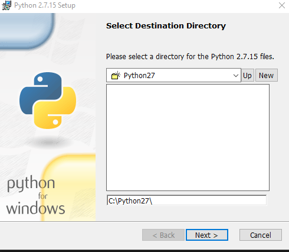

### Local Installation of all tools

If you have issues with the installations, let us know.  Python is particularly finnicky. 

**All tools must install cleanly.  If there are any errors please ask us for help or consider searching google/bing.  Blockchain tooling is bleeding edge and we've found the tools installations to be a bit frustrating to get going the first time.**

* vscode
* [Node.js 10.15.x or higher](https://nodejs.org/en/) 
  * to check for node: `node --version`
  * this is needed for npm later
* build tools (if running windows)
  * run this in an ELEVATED command prompt
  * `npm install --global --production windows-build-tools`
* git (2.10 +)
  * `git --version`
* [python 2.7.15](https://www.python.org/downloads/release/python-2715/)
  * **Please note:  you MUST have python 2.7.15.  I know this is old but it is REQUIRED for some of the OSS tooling.  Python3 won't work.  Not my fault**.  This requirement may change any day.  

>> Verification Steps: Ensure py27 is working _as the default python version_: 
>> * Open a cmd prompt 
>> * `python --version` should return 2.7.15
>> * If it doesn't then you may have to adjust your path to ensure it is the FIRST python listed on your path. Then relaunch your cmd prompt and try again.  If you need python 2.7 then continue:  

* Install python on windows
    * download 32bit from the link above
    * note the install location.  You'll need it:
    *  
    * Note that `Register Extensions` and `Add python to path` are ENABLED 

* [Truffle 5.0.0](https://www.trufflesuite.com/docs/truffle/getting-started/installation)
  * to verify:  `npm install -g truffle`
  * Truffle provides the building blocks to create, compile, deploy, and test blockchain applications.
* [Ganache](https://github.com/trufflesuite/ganache-cli)
  * full Ganache is not required but is useful for local blockchain development.  
  * minimally, ganache-cli is needed for vscode to communicate with Azure Blockchain service.
  * `npm install --global node-gyp`
  * `npm install -g ganache-cli`
  * to verify `ganache-cli version`  then ctl+C to exit.  
  * *What is ganache?*:  Ganache is for blockchain deployment for test environments. 
* Azure Blockchain DevKit for Ethereum
  * install it with the following command on any OS: `code --install-extension azblockchain.azure-blockchain`
  * now we need to confirm it's working
  * restart vscode
 

### Most Common Problem:  Resolving python 2.7 Issues

## Verification Steps

Please go to [EnvironmentSetup](EnvironmentSetup.md) to verify everything is working correctly and continue with the next steps.  

