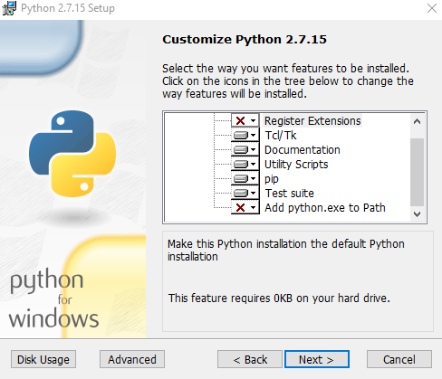
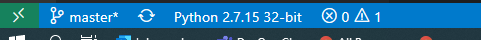
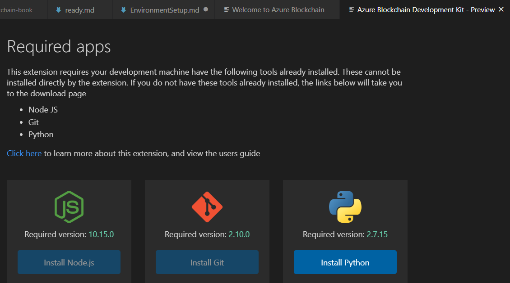

### Local Installation of all tools

If you have issues with the installations, let us know.  Python is particularly finnicky. 

* vscode
* [Node.js 10.15.x or higher](https://nodejs.org/en/) 
  * to check for node: `node --version`
  * this is needed for npm later
* git (2.10 +)
  * `git --version`
* [python 2.7.15](https://www.python.org/downloads/release/python-2715/)
  * **Please note:  you MUST have python 2.7.15.  I know this is old but it is REQUIRED for some of the OSS tooling.  Python3 won't work.  Not my fault**.  This requirement may change any day.  

>> Verification Steps: Ensure py27 is working with vscode: 
>> * Open vscode 
>> * Ctl + Shift + P
>> * begin typing `Python: select interpreter`
>> * Ensure 2.7.15 is available.  If it isn't, you need to install it.  

* Install python on windows
    * download 32bit from the link above
    * note the install location.  You'll need it:
    *  
    * Choose these options.  Note that `Register Extensions` and `Add python to path` are DISABLED .  
    * We do this because python 2.7 is very old and unsupported.  We don't want to ruin your existing python environment.  
    * Now follow the Verification Steps above.  
* [Truffle 5.0.0](https://www.trufflesuite.com/docs/truffle/getting-started/installation)
  * to verify:  `npm install -g truffle`
  * Truffle provides the building blocks to create, compile, deploy, and test blockchain applications.
* [Ganache](https://github.com/trufflesuite/ganache-cli)
  * full Ganache is not required but is useful for local blockchain development.  
  * minimally, ganache-cli is needed for vscode to communicate with Azure Blockchain service.
  * `npm install -g ganache-cli`
  * to verify `ganache-cli version`  then ctl+C to exit.  
  * *What is ganache?*:  Ganache is for blockchain deployment for test environments. 
* Azure Blockchain DevKit for Ethereum
  * install it with the following command on any OS: `code --install-extension azblockchain.azure-blockchain`
  * now we need to confirm it's working
  * restart vscode
  * Ctl+Shift-P to open the command palette
  * `Python: Select Interpreter`
  * choose `Python 2.7.15`
  * Your lower left statusbar should look like this:
  
 

### Most Common Problem:  Resolving python 2.7 Issues

If you have an error screen like this:

...it probably means vscode and the AzBC extension aren't recognizing python is installed.  Look at the vscode statusbar near the left.  Make sure it says `Python 2.7.15` .  

As long as it does, you can continue.  

## Verification Steps

Please go to [EnvironmentSetup](EnvironmentSetup.md) to verify everything is working correctly and continue with the next steps.  