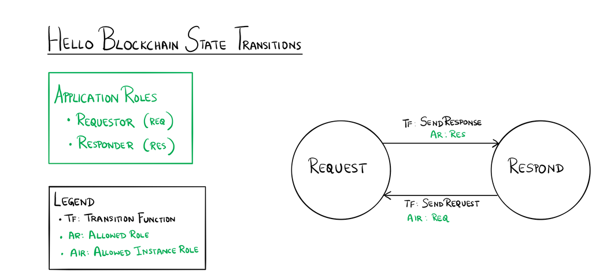

## Lab 00:  Hello Blockchain

This application expresses a workflow between a person sending a request and a person responding to the request. The state transition diagram below shows the interactions between the states in this workflow.

### Application Roles

* Requestor
  * the party initiating the request
* Responder
  * the party that responds to the request

### States

* Request
  * the state when the request is made
* Response
  * the state that occurs when the response is made

### Workflow




## Build the Solution

Let's build the solution.  

1. Create a folder to hold this project.  I'm using `solidity`.  Make sure this project is NOT a subfolder/subproject under an existing git repo.  The process of building a solidity application will create a new git repo for you.  
1. In vscode, Ctl+Shft+P then `Blockchain: New Solidty Project`
1. `Create Basic Project`, then create a subfolder called `hello-blockchain`.
1.  It will take a few mins to build the project structure.  After it is done do a `git commit` in vscode to save the "shell" project
1. Find the `HelloBlockchain.sol` and open it in an editor
  * Get familiar with the sample code, what it is doing.  
1. Find the `constructor` function and change it to this:

```
    constructor(string memory message) public
    {
        Requestor = msg.sender;
        RequestMessage = message;
        State = StateType.Request;
    }
```

We want to send our message as a request.  

`SendRequest` and `SendResponse` suit our purposes well and do not need to be changed.  The full code can be found in [HelloBlockchain.sol](./HelloBlockchain.sol)

* Right click on the sol file and choose `Deploy Contract`
  * Choose `deploy locally` for this first test.  This might be labeled as `truffle development`
