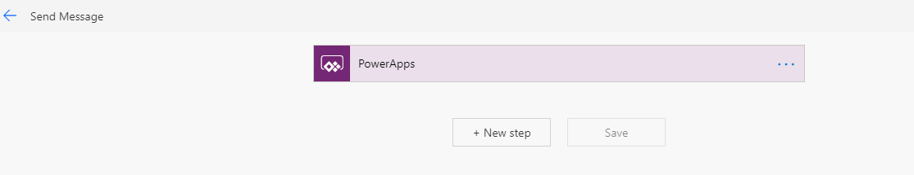

## Hack04: Add value to your Smart Contract using Flow

* A Smart Contract is great but we usually want to integrate the Smart Contract into an existing application or workflow.  The easiest way to do this is by building a Flow, which is a serverless, no-code solution.  In this lab we'll look at how easy it is to add our Smart Contract to a Flow.  
* We could do something similarly with an Azure Logic App.  

>>For the below example we are simply going to use our HelloBlockchain.sol Smart Contract and interact with it using Flow.  You can instead use the contract YOU created.  

For the HelloBlockchain example we will need 2 Flows, the Sender flow and the "Query" flow.  The Sender Flow will allow us to post a transaction to the blockchain and the Query Flow will allow us to retrieve the message from the blockchain that our Sender posted.  Let's create 2 basic flows to connect to an Ethereum Blockchain, in our case we will connect to our Azure Blockchain Service.  

>>Note:  most of the below steps will be _similar_ for Logic Apps.  Feel free to use Logic Apps instead of Flow to interact with your smart contract.  [Some helpful instructions](https://docs.microsoft.com/en-us/azure/blockchain/service/ethereum-logic-app).  

* Navigate to https://powerapps.microsoft.com
* Choose Sign In or Sign Up as needed
* On the left side choose `Flows`
* Select `+ New`
* Choose `Instant—from blank`
* Type in the Flow name, in my case `SendMessage`, select `PowerApps` as the trigger, and click `Create`

You should see something similar to this:

## Create the Sender Flow

* Select `+ New step` and search for `Ethereum` and select the Ethereum Connector
* Select `Execute smart contract function`
  * Any name will suffice
  * For `RPC Endpoint` this can be found in vscode by right clicking your ABS member

  * Private Key can also be retrieved from vscode:

  * Acct address and password is not needed if using the mnemonic
* Now we need to enter the Smart Contract details.

  * the ABI and contract address can be found by following <a href="https://docs.microsoft.com/en-us/azure/blockchain/service/ethereum-logic-app#get-the-contract-abi" target="_blank">these instructions</a>.  

If you've done it correctly the Smart Contract name should automatically populate, similar to this:

>> For the message, make sure you use `Ask in PowerApp`.  

* You will need to complete `Gas Price in Wei` and `Gas Limit`.  See the screenshot above for possible values.  

* Now Choose `+New Step` then `PowerApps` then `Respond to a PowerApp or flow`...we want to respond to our blockchain message, in my example.  

* Click `+ Add an output` and choose `Text` enter `transactionHash` and select `Transaction Hash` from Ethereum.

* Save your Flow

## Create the Query Flow

We are going to follow the same basic steps to create the Query flow.  It will read the posted message from the Sender.  

* Create a new flow with the name `QueryMessage`.  Trigger: `Power Apps` 
* Click `+ New step` and search for `Ethereum` and select `Get smart contract state (all properties)`
* Enter the ABI and contract address.
* `+ New step` and search for `PowerApps` and select `Respond to a PowerApp or flow`
* Select `+ Add an output` and select `Text`.  Enter title, `requestMessage` and select `RequestMessage` from the Ethereum Blockchain. Select `Save`. 

* Save your flow.  

## Let's Build a Phone App to Execute Our Smart Contract Workflow

* Click on `Apps`, `New App`, `Canvas`, `Blank App`, and `Phone Layout`

* Add the following components to the PowerApp:
  * Label `Message to be sent:`
  * Text Input
  * Button -> `Send Request`
  * Label -> `Transaction Hash:`
  * Label -> for transaction hash
  * Label -> `Message sent:`
  * Label -> for message sent
  * Button -> `Get Request`

It should look somthing like this:

* Click on the Send Button, then Action, then Power Automate.

* Choose your Flow.  
* The function should be set to `Set(TXHash, SendMessage.Run(TextInput1.Text))`
* In the transaction hash label set the function to `TXHash.transactionHash`

* Set the `Get Request` button to the `Query Message` flow.  The function : `Set(RequestMessage, QueryMessage.Run())`.  This is running our Flow and then setting a variable called RequestMessage that we can use next

* Set the Message Sent label to: `RequestMessage.requestmessage`

* Press F5 to run the Power App
* Test it

**Congratulations, you integrated the blockchain into a simple workflow app**