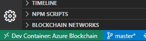
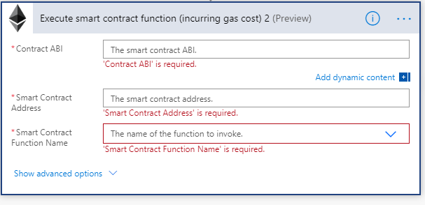
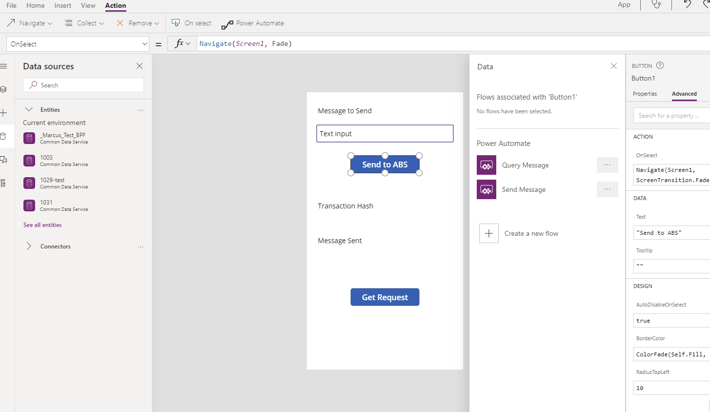

# Creating Smart Contracts

## Background

For this hack we are going to build a `Hello World` -style application so you understand the basic workflow to build a _very_ simplistic smart contract dapp.  All we are going to do is:
* send a message to a receiver
* the receiver will ack it and send a response back

That completes the smart contract.  

We use the Truffle Suite under-the-covers in vscode to develop smart contracts in Ethereum, deploying to Azure. 

>>With blockchain, iterative development is your friend.  Don't try to do too much before you test your smart contract.  After every successful test, consider committing your changes to git.  

## Getting Started

This is a good lab to ensure your environment is working.  

Make sure you have followed the steps in [EnvironmentSetup.md](EnvironmentSetup.md)

Whenever you create a new blockchain project:  

* Open vscode 
  * If using the remote container for development, ensure you are working from within that spawned vscode instance which denotes in the lower left that you are running against the container



* <kbd>F1</kbd>:  `Blockchain:  show welcome page` 
  * this will start all of the extensions and ensure all software is in a working state
* <kbd>F1</kbd>:  `Terminal: Create New Integrated Terminal`
  * `mkdir solidity-contract`

>> When doing blockchain development you can choose to have all of your smart contracts under one project, or each in their own project  

* <kbd>F1</kbd>:  `Blockchain: New Solidity Contract`
* `Create basic project`
* when it asks for the folder choose the folder and path you created above (likely:  `/workspaces/blockchain-hackathon/solidity-contract/`)
* the project will take a few mins to create
>> If you want to see what this is doing just select `Output` at the bottom of vscode and `Azure blockchain`. :


    

* when completed you should see something like this in your explorer pane:  


This is our smart contract code template with all of the supporting files.  Take a minute to familiarize yourself with the contents of the folder.  

* all contracts you create will be in the `contracts` folder.  
* It's always best to make a copy of the `HelloBlockchain.sol` and start new development using that as a template.  
* `migrations` contains the instructions to deploy a smart contract.  
* `truffle-config.js` will have the configurations for your ethereum networks.  This will minimally contain your local development network and might contain your Azure settings.  

Find your Solidity template contract.  It's likely called `HelloBlockchain.sol`.  Open that file in your editor. 

>> All new solidity projects start with this HelloBlockchain solidity file.  In later labs we will modify the name of the smart contract so it reflects its purpose

Take a few minutes to get familiar with what this solidity contract does.  
* This does a simple request/response workflow.  

### Deploy HelloBlockchain locally

We want to test that minimally our devenv is working and we can do local development.  

* You'll immediately likely see that the file is red and there is a problem in the `PROBLEMS` section of the output pane.  
  * It will likely say something about `compiler version is 0.7.0` but our sol file is using:   
  `pragma solidity ^0.5.0;` 
  let's change that to:  
  `pragma solidity >0.5.0;` :  Note:  we changed the carat to a `>`.  This is telling solidity to use a minimum of compile v5 vs strictly v5.  
* Right click the sol file and choose `Build contracts`.  Make sure there are no problems (errors) in the output. 
>> Note that the build created a `build/contracts` folder with a json file.  This is what will actually be deployed.   
* Right click the sol file and choose Deploy.  There should be an entry for `development`
* If you want to see what this is doing just `Ctl+~` (ctl + backtick(above TAB on most kbds)) and select `Output` and `Azure blockchain`.  You should see the commands and the success message.  
  * Take a minute to get familiar with what a deploy is doing by reading the output messages.  

* At this point we can send test transactions to our local truffle network.  Right click the sol file again and `Show Smart Contract Interaction Page.`

>> As of the writing of this workshop the Smart Contract Interaction Page only works on Windows (not the Ubuntu container though).  That's ok, we will deploy it to Azure next to test it.  Sorry.  

## Deploy the Smart Contract to ABS

Let's deploy our HelloBlockchain to ABS.  

Right click `Deploy Contracts`.  This time choose your Azure Blockchain Service.  

* Choose Generate Mnemonic if asked (this is similar to a password or token)

If you see an error like this...


```
[Execute command] Error:  *** Deployment Failed ***

"Migrations" -- method handler crashed.
```

...then we have an older version of truffle and ganache.  

>>FIX:  Open your truffle-config.js and remove the line that reads:
>>```gas: 0,```   
>> then redeploy.  


Let's test the contract using the GUI.  
* Right click the contract and choose `Show Smart Contract Interaction Page. 
* You should see something that looks like this:  


Take a minute a familiarize yourself with what is going on.  **Make sure you scroll to see the metadata at the bottom. If it crashes don't worry, we have other ways to test our smart contracts.  There are some known issues with the Smart Contract UI unfortunately.** 

### What is vscode doing?

vscode is just a wrapper around truffle and ganache calls.  You can run these calls yourself by ensuring the OUTPUT window is open and you have `Azure Blockchain` selected.  Here are examples of the calls being made that you might want to experiment with:

```

# deploy (called "migrate" in blockchain-speak) a contract to a network
npx truffle migrate --reset -network <your network name>

# this allows you to integrate with the blockchain network in real-time.  
# type .exit to exit the console
truffle console --network <your network name>

```

## Let's make some basic changes to our contract and deploy again

Let's add 2 add'l functions to our solidity file:

```
    function getRequestMessage() public view returns (string memory) {
        return RequestMessage;
    }
    function getResponseMessage() public view returns (string memory) {
        return ResponseMessage;
    }
```

We are adding 2 functions that we can call against our contract to see information about the contract, namely the messages sent to/from the actors.  

**Paste those lines BEFORE the closing } of the `contract`**

* Right click the sol file and click `Build Contracts`
* This should create a `build/contracts` folder.  Familiarize yourself a bit with the resulting build files.  
* Right click the sol file and click `Deploy`
  * You should have at least 2 options for the target:  `development` and `Azure Blockchain`.  Choose `development`
  * Then choose ABS and test the deployment there

### Let's interact with our contract from the command line

Go to your terminal in vscode and paste:

```
truffle console --network <your abs network name from truffle-config.js>
```

You should see a truffle prompt.  

Now try the following:

```
HelloBlockchain.deployed().then(i => {i.SendRequest("my request")})

# you'll likely see "undefined" as the response since we aren't ACK'ing the message in the original HelloBlockchain.sol file.  The original truffle developers should've done this in the solidity contract.  We can fix that later.  

HelloBlockchain.deployed().then(i => { return i.RequestMessage.call(); })
# this should return whatever you LAST sent

```

Run `.exit` to exit the truffle console.  

Run `git add .` and `git commit -am"init commit"` to save our Hello World example.  `git init` is run automatically for us whenever we create a new solidity project.  We can use this as a base for the next hacks.  

**Congratulations! You have successfully interacted with a blockchain using the standard ethereum tooling**


## Optional:  Using Flow 

The next step you might consider is manipulating your smart contract from a workflow UI, especially if you couldn't get the Smart Contract UI in vscode to work.  

Generally you would build any smart contract into an existing workflow. The easiest way to do this is by building a Flow, which is a serverless, no-code solution.  In this lab we'll look at how easy it is to add our Smart Contract to a Flow.  
* We could do something similarly with an Azure Logic App.  

For the HelloBlockchain example we will need 2 Flows, the Sender flow and the "Query" flow.  The Sender Flow will allow us to post a transaction to the blockchain and the Query Flow will allow us to retrieve the message from the blockchain that our Sender posted.  Let's create 2 basic flows to connect to an Ethereum Blockchain, in our case we will connect to our Azure Blockchain Service.  

>>Note:  most of the below steps will be _similar_ for Logic Apps.  Feel free to use Logic Apps instead of Flow to interact with your smart contract.  [Some helpful instructions](https://docs.microsoft.com/en-us/azure/blockchain/service/ethereum-logic-app).  

* Navigate to https://powerapps.microsoft.com
* Choose Sign In or Sign Up as needed
* On the left side choose `Flows`
* Select `+ New`
* Choose `Instant—from blank`
* Type in the Flow name, in this case `SendMessage`, select `PowerApps` as the trigger, and click `Create`

You should see something similar to this:


## Create the Sender Flow

* Select `+ New step` and search for `Ethereum` and select the Ethereum Connector
* Select `Execute smart contract function`
  * Any name will suffice
  * For `RPC Endpoint` this can be found in vscode by right clicking your ABS member


  * Private Key can also be retrieved from vscode:


  * Acct address and password is not needed if using the mnemonic
* Now we need to enter the Smart Contract details.


  * the ABI and contract address can be found by following <a href="https://docs.microsoft.com/en-us/azure/blockchain/service/ethereum-logic-app#get-the-contract-abi" target="_blank">these instructions</a>.  

If you've done it correctly the Smart Contract name should automatically populate, similar to this:


>> For the message, make sure you use `Ask in PowerApp`.  

* You will need to complete `Gas Price in Wei` and `Gas Limit`.  See the screenshot above for possible values.  

* Now Choose `+New Step` then `PowerApps` then `Respond to a PowerApp or flow`...we want to respond to our blockchain message, in my example.  


* Click `+ Add an output` and choose `Text` enter `transactionHash` and select `Transaction Hash` from Ethereum.


* Save your Flow

## Create the Query Flow

We are going to follow the same basic steps to create the Query flow.  It will read the posted message from the Sender.  

* Create a new flow with the name `QueryMessage`.  Trigger: `Power Apps` 
* Click `+ New step` and search for `Ethereum` and select `Get smart contract state (all properties)`
* Enter the ABI and contract address.
* `+ New step` and search for `PowerApps` and select `Respond to a PowerApp or flow`
* Select `+ Add an output` and select `Text`.  Enter title, `requestMessage` and select `RequestMessage` from the Ethereum Blockchain. Select `Save`. 


* Save your flow.  

## Let's Build a Phone App to Execute Our Smart Contract Workflow

* Click on `Apps`, `New App`, `Canvas`, `Blank App`, and `Phone Layout`


* Add the following components to the PowerApp:
  * Label `Message to be sent:`
  * Text Input
  * Button -> `Send Request`
  * Label -> `Transaction Hash:`
  * Label -> for transaction hash
  * Label -> `Message sent:`
  * Label -> for message sent
  * Button -> `Get Request`

It should look somthing like this:


* Click on the Send Button, then Action, then Power Automate.



* Choose your Flow.  
* The function should be set to `Set(TXHash, SendMessage.Run(TextInput1.Text))`
* In the transaction hash label set the function to `TXHash.transactionHash`


* Set the `Get Request` button to the `Query Message` flow.  The function : `Set(RequestMessage, QueryMessage.Run())`.  This is running our Flow and then setting a variable called RequestMessage that we can use next


* Set the Message Sent label to: `RequestMessage.requestmessage`


* Press F5 to run the Power App
* Test it

**Congratulations, you integrated the blockchain into a simple workflow app**