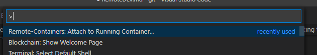
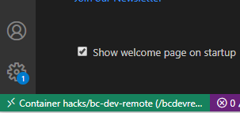
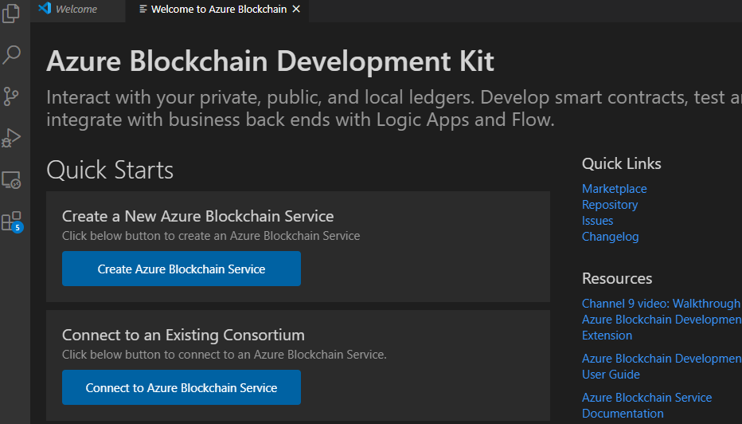

## "Remote Development" using vscode and a blockchain docker container

**All tools must install cleanly.  If there are any errors please ask us for help or consider searching google/bing.  Blockchain tooling is bleeding edge and we've found the tools installations to be a bit frustrating to get going the first time.**

Since 

## Software

You will need the following:  

* vscode
  * add the following extensions
    * Remote-Containers
    * Remote Development
* Docker Desktop
  * the exact instructions to install docker desktop on your laptop varies depending on whether you use mac, linux, or windows (and depending on the version of windows too).  
  * we can help if needed
  * to test your docker deployment run the following container
  * `docker run --name docker-test -d -p 8081:80 docker/getting-started`
  * and then connect to:  `http:/localhost:8081`
  * when everything is working you can run the following to stop this container

```bash
docker stop docker-test
docker rm docker-test
```

## Build the container from the Dockerfile

These instructions assume you are running from bash/WSL.  You can also run them with powershell with some slight modifications

```bash
# first, clone this git repo to a directory where you normally do development
git clone https://github.com/davew-msft/blockchain-hackathon.git  blockchain-hackathon
cd blockchain-hackathon
cd remote-dev

# this will take awhile.  
# you will see a lot of npm WARN messages in red.  They can all be ignored.  
# just make sure the final command outoput is something like 
# Successfully built fe70b0187782
# Successfully tagged hacks/bc-dev-remote:latest
docker build -t hacks/bc-dev-remote .  --label "version=0.2"

docker run --name bcdevremote -d -p 2022:22 --privileged hacks/bc-dev-remote

# the container should be running now.  You can check with: 
docker ps
# you should see hacks/bc-dev-remote  under IMAGE column
```

### Troubleshooting the container, if needed

```bash
# to connect to ssh, if needed later
docker exec -it bcdevremote /bin/bash

# to stop, remove the container and remove the image
docker stop bcdevremote
docker rm bcdevremote
docker image rm hacks/bc-dev-remote
```


## Using the container with vscode

* Start vscode
* Ctl + Shift+ P and begin typing: `Remote-Containers: Attach to Running Container`


* Connect to the container called `bcdevremote`
* This will open a new vscode window.  If you look carefully at the lower left of the window you should see that this new vscode window is using the container as the compute engine.  

* Now we need to install a few things in this container:
  * extension:  blockchain development kit for ethereum
  * you will need to reload vscode.  click `Reload Required`
  * this will only close the instance of vscode running in the container.  Relaunch vscode in the container by again: `Remote-Containers: Attach to Running Container`
* Ctl + Shift+ P :  `Blockchain:  Show Welcome Page`
* Showing the welcome screen will also run the blockchain dependency checker.  
* Install any of the required missing dependencies.  This is likely Truffle Suite and Ganache CLI:


* Close this vscode child window
* Relaunch vscode in the container by again: `Remote-Containers: Attach to Running Container`

* You should not see any errors are missing dependencies.  You should just see the standard welcome screen:





Please return to [EnvironmentSetup](../EnvironmentSetup.md) and run all of the verification steps.  


