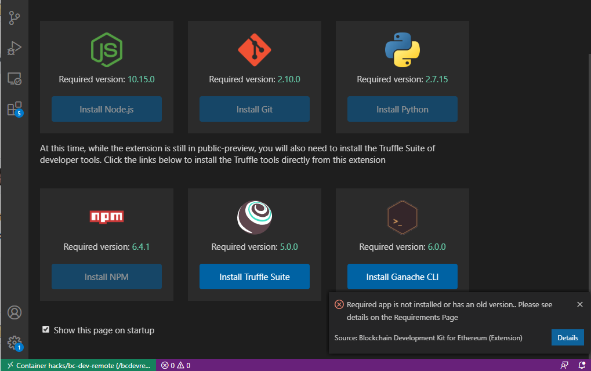

## "Remote Development" using vscode and a blockchain docker container

**All tools must install cleanly.  If there are any errors please ask us for help or consider searching google/bing.  Blockchain tooling is bleeding edge and we've found the tools installations to be a bit frustrating to get going the first time.**

Since 

## Software

You will need the following:  

* git
* vscode
  * add the following extensions
    * Remote-Containers
    * Remote Development
* Docker Desktop
  * the exact instructions to install docker desktop on your laptop varies depending on whether you use mac, linux, or windows (and depending on the version of windows too).  
  * we can help if needed
  * to test your docker deployment run the following container
  * `docker run --name docker-test -d -p 8081:80 docker/getting-started`
  * and then connect to:  `http:/localhost:8081`
  * when everything is working you can run the following to stop this container

```bash
docker stop docker-test
docker rm docker-test
```

## Get vscode ready

1. create a folder on your machine for your project, or use an existing folder.  

```bash
# first, clone this git repo to a directory where you normally do development
git clone https://github.com/davew-msft/blockchain-hackathon.git  blockchain-hackathon
cd blockchain-hackathon
```
1. start vscode
1. Press <kbd>F1</kbd> and select `Remote-Containers: Reopen Folder in Container`

In the lower left corner you should see that you are now running vscode using the container as the compute engine


* <kbd>F1</kbd> :  `Blockchain:  Show Welcome Page`
>> Showing the welcome screen will also run the blockchain dependency checker.  It's good to re-run this whenever you restart the container, just in case you installed something that accidentally broke blockchain tooling, if it asks you to:  





## Connect vscode to Azure Blockchain Service


* In the vscode explorer pane, expand the `Blockchain Networks` option


* Choose `Connect to Network`, and `Azure Blockchain` and connect to your consortium, following the prompts. It should look something like this:  


**You did it, everything is working!**

We can now move on and show how to create Smart Contracts on a blockchain.  

You can return to [the homepage](./README.md) or continue to [Hack01:  Creating Smart Contracts](../labs/SmartContractIdeation/SmartContracts.md) where we will build a sample Hello World blockchain dapp.  


